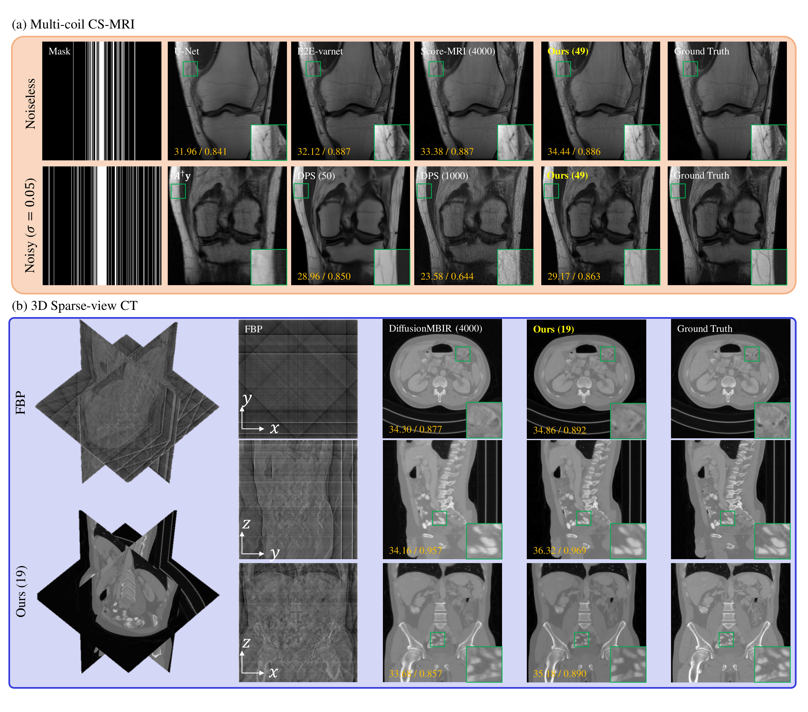

# DDS

[Hyungjin Chung](https://www.hj-chung.com/), Suhyeon Lee, [Jong Chul Ye](https://bispl.weebly.com/professor.html)  

📢📢 The pre-trained model checkpoints and data are moved to a [new location](https://www.dropbox.com/scl/fo/mlkwofr24nmsnzixj5u4d/AI-JOLUOAzklINnr8FdKpdk?rlkey=p4bj5ny58tngsjd1j46iyoqh6&st=lba2c97z&dl=0).

Official PyTorch implementation for **Decomposed Diffusion Sampling (DDS)**, presented in the paper [Decomposed Diffusion Sampler for Accelerating Large-Scale Inverse Problems](https://arxiv.org/abs/2303.05754).


## Getting Started

### Download pre-trained modei weights

```
# Download pre-trained model weights
mkdir -p './exp/vp'
wget -O './exp/vp/AAPM256_1M.pth' 'https://www.dropbox.com/scl/fi/hs75uqc9zgwi8en71g488/AAPM256_1M.pt?rlkey=s1otrarzz1tbr7j6nwc5rh1r6&dl=1'
wget -O './exp/vp/fastmri_brain_320_complex_1m.pth' 'https://www.dropbox.com/scl/fi/1884de5g904fch2bah4bl/fastmri_knee_320_complex_1m.pt?rlkey=qukkxajxp6broc1fn613cdvp2&dl=1'
```

### Download sample test data

```
# Download sample test data
mkdir -p './indist_samples'
wget -O './indist_samples/data.zip' 'https://www.dropbox.com/scl/fo/rlxuhs5maial9cnwc533d/h?rlkey=9zovjgghncnt8ej4acdsb1a5d&dl=1'
# Extract zip file
unzip -q ./indist_samples/data.zip -d ./indist_samples
```

By default, the above scripts places the pre-trained model checkpoints under ```exp/vp```, and the sample data under ```indist_samples```. When saving to different directories, you can reflect this by modifying the ```--dataset_path``` flag for the ```main.py``` file.

## DDS reconstruction

We provide demo scripts for the following inverse problems:
- Multi-coil MRI reconstruction (2d)
- Sparse-view CT reconstruction (2d, 3d)
- Limited-angle CT reconstruction (3d)

Each experiments can be run by simply running
```
bash eval_MRI_multi.sh
bash eval_SVCT_2d.sh
bash eval_SVCT_3d.sh
bash eval_LACT_3d.sh
```

## Citation
If you find our work interesting, please consider citing

```
@article{chung2023decomposed,
  title={Decomposed Diffusion Sampler for Accelerating Large-Scale Inverse Problems},
  author={Chung, Hyungjin and Lee, Suhyeon and Ye, Jong Chul},
  journal={arXiv preprint arXiv:2303.05754},
  year={2023}
}
```
